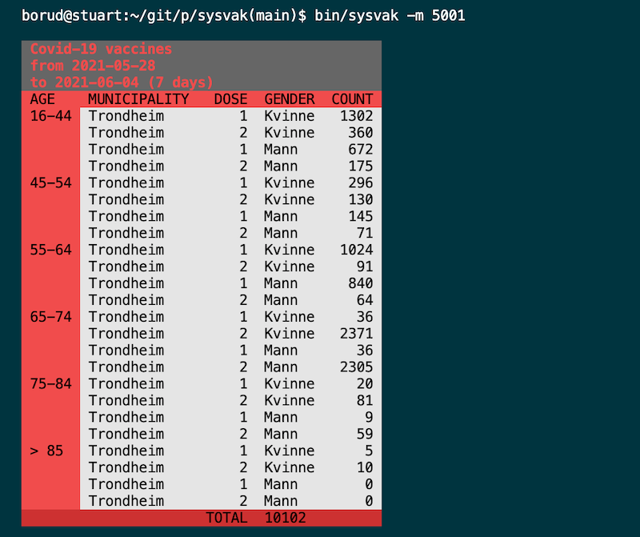

# sysvak

Simple utility for digging out Covid-19 vaccine data for Norway from SYSVAK.  I wrote this because I wanted something that was quick and easy and allowed me to pipe data into other applications.



## Install

    go get -u github.com/borud/sysvak/cmd/sysvak

## Command line options

```
$ bin/sysvak -h
Usage:
  sysvak [OPTIONS]

Application Options:
  -f, --from=                                 from date (defaults to 1 week ago)
  -t, --to=                                   to date (defaults to now)
  -d, --dose=                                 which doeses (default: 1,2)
  -m, --municipality=                         Municipality code(s)
  -g, --gender=                               genders (default: M,K)
  -a, --age=                                  age ranges, comma separated (default: 1,2,3,4,5,6,7)
  -o, --output=[json|csv|table|markdown|html] output format (default: table)
  -n, --no-color                              turn off colors in table output
  -l, --list-muni                             list municipality codes
  -x, --list-ages                             list age ranges
  -v                                          Verbose mode

Help Options:
  -h, --help                                  Show this help message
```
